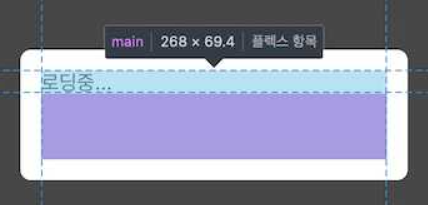
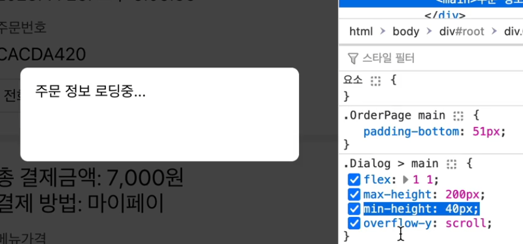

# 다이얼로그(2)

기존 다이얼로그에 몇가지 문제(버그)가 있음.
- 중첩된 DOM 아래에 있기때문에 부모스타일에 영향을 받는다. (부모 Layout css)
- `!important`로 해결하려해도 한계가 있음.




-> React Portal로 해결가능?!

## 그전에 Portal 없이 해결가능하지 않을까

```javascript
const root = ReactDOM.createRoot(document.getElementById("root"))
const root2 = ReactDOM.createRoot(document.getElementById("dialog"))

root.render(<Green />)
root2.render(<Red />)
```
- 스타일 상속을 피할 수 있다 -> 복잡한 UI구성 유연.
- 컴포넌트의 재배치로 불필요한 렌더링 줄어듦. -> 성능 최적화
    - (예:  예를 들어, 상위 컴포넌트에서 자식 컴포넌트를 렌더링하면서 상태(State)를 변경하면, 해당 컴포넌트와 그 자식 컴포넌트가 모두 다시 렌더링)

-> 하지만 특정 DOM 안에 배치할 수 없다는 한계가 있다.
(예: `#dialog` 태그를 `root`가 아닌 `app` 안으로?)


## 리엑트 포탈로 해결해보자.

- Basic

```js
const Red = () =>
  ReactDOM.createPortal(
    <div className="red">red</div>,
    document.querySelector("#dialog")
  )
```

- WithLayout
```js
export const DialogContainer = withLayout(
  ({ dialog }) =>
    dialog &&
    ReactDOM.createPortal(
      <Backdrop>{dialog}</Backdrop>,
      document.querySelector("#dialog")
    )
)
```


## 응용

### Error Dialog

- `errorDialog.jsx`
```js
import { withLayout } from "../lib/MyLayout";
import Button from "./Button";
import Dialog from "./Dialog";

const ErrorDialog = ({ closeDialog }) => (
  <Dialog
    header={<>오류</>}
    footer={<Button onClick={closeDialog}>네, 알겠습니다.</Button>}
  >
    잠시 후 다시 시도해 주세요.
  </Dialog>
);

export default withLayout(ErrorDialog);

```

- `productPage.jsx`
```js
class ProductPage extends React.Component {
  constructor(props) {
    super(props);
    this.state = {
      productList: [],
    };
  }

  componentDidMount() {
    this.fetch();
  }

  async fetch() {
    const { startLoading, finishLoading, openDialog } = this.props;

    try {
      throw "fake error";
    } catch (e) {
      openDialog(<ErrorDialog />);
      return;
    }
    finishLoading();
  }

  render() {
    return (
      <div className="ProductPage">
        <Page header={<Title>메뉴목록</Title>} footer={<Navbar />}>
          <ul>
            {this.state.productList.map((product) => (
              <li key={product.id}>
                <OrderableProductItem product={product} />
              </li>
            ))}
          </ul>
        </Page>
      </div>
    );
  }
}

export default MyLayout.withLayout(ProductPage);
```